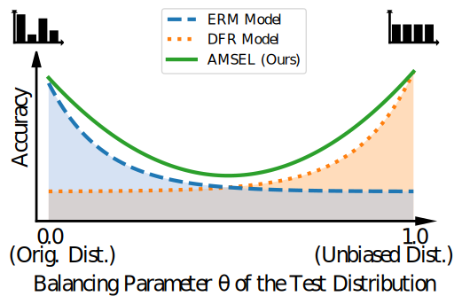

<div align="center">

# **Adaptive Model Selection for Expanded Post Hoc Debiasing (AMSEL)**

[](https://blunk.sh/blunk2025amsel.pdf)
[](https://caip2025.com)
[](https://opensource.org/licenses/MIT)

</div>

<p align="center">
  Official PyTorch implementation for the paper:<br>
  <b>Adaptive Model Selection for Expanded Post Hoc Debiasing and Mitigating Varying Degrees of Spurious Correlations</b><br>
  <a href=https://inf-cv.uni-jena.de/home/staff/blunk/>J. Blunk</a>, <a href=https://inf-cv.uni-jena.de/home/staff/bodesheim/>P. Bodesheim</a>, <a href=https://inf-cv.uni-jena.de/home/staff/denzler/>J. Denzler</a>
</p>

<p align="center">
  
  <br>
  <em>AMSEL (green) adapts to the test distribution's bias level (x-axis), outperforming fixed methods like ERM (blue) and DFR (orange) which excel only at the extremes.</em>
</p>

---

## 🎯 Method Overview

**Should a model be forced to ignore a useful shortcut?** Current debiasing methods say "yes," optimizing for a purely unbiased world. This creates a difficult trade-off: they gain robustness on unbiased data but lose accuracy whenever the test data still reflects the original biases. This approach is optimized for a single, idealized scenario — a risky assumption when real-world data can have varying, unknown levels of spurious correlation.

Our **Adaptive Model SELection (AMSEL)** rejects this rigid, one-size-fits-all approach. We argue for a more pragmatic goal: achieve the best performance on the data at hand, whatever its bias level. To achieve this, we frame the problem as **dynamic classifier selection**. Instead of training a single model, we build a **family of lightweight classifier heads**, each an expert for a different degree of spurious correlation. At test time, AMSEL estimates the bias in the incoming data and deploys the specialist head best suited for the job.

This lightweight, post-hoc approach ensures robust performance across the entire spectrum of bias, from the original biased distribution to a fully balanced one. The method consists of three stages:

1.  **Candidate Construction 🏗️:** Train a family of lightweight classifier heads $`\{h_\theta\}`$ on a fixed feature extractor. Each head is optimized for a specific degree of bias, controlled by a parameter $`\theta`$.
2.  **Bias Estimation 🔍:** Learn a simple mapping $`M`$ from a **consensus score** (measuring agreement between the most and least biased models) to the corresponding bias parameter $`\theta`$.
3.  **Adaptive Inference 🚀:** At test time, compute the score on the test data, estimate its bias level $`\theta_{\mathrm{test}} = M(s(\mathcal{D}_{\mathrm{test}}))`$, and select the best-suited model $`m_{\theta_{\mathrm{test}}}`$ for prediction.

<!-- | Step 1: Candidate Construction 🏗️ | Step 2: Bias Estimation 🔍 | Step 3: Adaptive Inference 🚀 |
| :--- | :--- | :--- |
| Train a family of lightweight classifier heads $\{h_\theta\}$ on a fixed feature extractor. Each head is optimized for a specific degree of bias, controlled by a parameter $\theta$. | Learn a simple mapping $M$ from a **consensus score** (measuring agreement between the most and least biased models) to the corresponding bias parameter $\theta$. | At test time, compute the score on the test data, estimate its bias level $\theta_{\mathrm{test}} = M(s(\mathcal{D}_{\mathrm{test}}))$, and select the best-suited model $m_{\theta_{\mathrm{test}}}$ for prediction. |

This approach allows AMSEL to be robust across a wide spectrum of strengthspurious correlations without retraining the expensive feature extractor. -->

## ⚙️ Getting Started

This project has been tested on Python 3.12. Follow these steps to set up your environment and run the experiments.

### 1. Environment and Dependencies

First, clone the repository and set up a virtual environment to keep dependencies isolated.

```bash
git clone https://github.com/your-username/your-repo-name.git
cd your-repo-name

# Create and activate a conda environment (or use venv)
conda create -n "amsel" python=3.12
conda activate amsel
```

Next, install the required packages. This is a two-step process:

  a. **Install PyTorch:** Visit the [official PyTorch website](https://pytorch.org/get-started/locally/) to get the correct command for your hardware (CUDA version, CPU, etc.). For a typical CUDA 11.8 setup, the command is:
     ```bash
     pip install torch torchvision --index-url https://download.pytorch.org/whl/cu118
     ```

  b. **Install Remaining Packages:** Once PyTorch is installed, run:
     ```bash
     pip install -r requirements.txt
     ```

> **✒️ Note on Plotting:** To ensure our plots match the paper's typography, we use `matplotlib`'s LaTeX rendering engine. This requires a working LaTeX distribution on your system. Please see the official [matplotlib documentation](https://matplotlib.org/stable/users/explain/text/usetex.html#usetex) for installation instructions.

### 2. Datasets and Pre-trained Models

Our framework is designed to **download and set up all necessary data and models automatically** when you run an experiment for the first time.

| Dataset | Task & Spurious Correlation | Base Model (ERM) |
| :--- | :--- | :--- |
| **CelebA** | Predict **blond hair**, spuriously correlated with **gender**. | ResNet50 |
| **ChestX-ray14** | Detect **pneumothorax**, spuriously correlated with **chest drains**. | DenseNet121 |

*The base models follow the training procedures from Izmailov et al. (2022) and Murali et al. (2023), respectively.*

If the automatic download fails (e.g., due to network issues or rate limits), you can perform a manual setup using the instructions below.

<details>
<summary><strong>Manual Setup for CelebA</strong></summary>

* **Dataset Files:** The automatic download via `torchvision` can sometimes fail due to Google Drive rate limits. If this happens:
    1.  Go to the [official CelebA project page](http://mmlab.ie.cuhk.edu.hk/projects/CelebA.html).
    2.  Download `img_align_celeba.zip` and the four `list_*.txt` annotation files.
    3.  Unzip the images and place the `img_align_celeba` folder and all `.txt` files directly inside `data/celeba/`.

* **Model Weights:**
    1.  Download the `celeba_models.zip` from our [**GitHub Releases page**](https://github.com/debiasing/AMSEL/releases).
    2.  Extract the contents into the `data/celeba/models/` directory.

</details>

<details>
<summary><strong>Manual Setup for ChestX-ray14</strong></summary>

* **Dataset Files:** The ChestX-ray14 dataset files and pre-processed annotations are only available via automatic download from our GitHub release. Manual download for the dataset is not provided at this time.

* **Model Weights:**
    1.  Download the `chestx-ray14_models.zip` from our [**GitHub Releases page**](https://github.com/debiasing/AMSEL/releases).
    2.  Extract the contents into the `data/chestx-ray14/models/` directory.

</details>

<details>
<summary>Click to see the final expected directory structure.</summary>

After a successful setup (either automatic or manual), your `data` directory should look like this:

```
data/
├── celeba/
│   ├── img_align_celeba/
│   │   ├── 000001.jpg
│   │   └── ...
│   ├── models/
│   │   ├── izmailov_resnet50_erm_seed1/
│   │   │   └── best_model.th
│   │   ├── izmailov_resnet50_erm_seed2/
│   │   └── ...
│   ├── identity_CelebA.txt
│   ├── list_attr_celeba.txt
│   ├── list_bbox_celeba.txt
│   ├── list_eval_partition.txt
│   └── list_landmarks_align_celeba.txt
│
└── chestx-ray14/
    ├── images/
    │   ├── 00000001_000.png
    │   └── ...
    ├── models/
    │   ├── murali_dense121_erm_seed1/
    │   │   └── best_model.th
    │   ├── murali_dense121_erm_seed2/
    │   └── ...
    ├── nih_full.xlsx
    ├── nih_subset.xlsx
    ├── nih_full_processed.csv
    ├── nih_train_val_processed.csv
    └── nih_test_processed.csv
```

</details>

## 🚀 Reproduce Our Results

### Main Experiments

To reproduce the main results from our paper (e.g., the performance plots and AUC tables), run the [`adaptive_model_selection.ipynb`](./adaptive_model_selection.ipynb) notebook. This script uses the optimal hyperparameters we selected for the paper.

#### Recommended Method: Papermill
The easiest way to reproduce our findings is via [Papermill](https://papermill.readthedocs.io/en/latest/), which runs the notebook from the command line and saves the output.

```bash
# Run experiments for CelebA
papermill --log-output --progress-bar --request-save-on-cell-execute adaptive_model_selection.ipynb outputs/celeba_results.ipynb -p dataset_name celeba

# Run experiments for ChestX-ray14
papermill --log-output --progress-bar --request-save-on-cell-execute adaptive_model_selection.ipynb outputs/chestx-ray14_results.ipynb -p dataset_name chestx-ray14
```
<!--- Alternative for detached running:
screen -L -Logfile outputs/celeba_log.txt -S AMSEL-CelebA papermill --log-output --progress-bar --request-save-on-cell-execute adaptive_model_selection.ipynb outputs/celeba_results.ipynb -p dataset_name celeba

screen -L -Logfile outputs/chestx-ray14_log.txt -S AMSEL-ChestX-ray14 papermill --log-output --progress-bar --request-save-on-cell-execute adaptive_model_selection.ipynb outputs/chestx-ray14_results.ipynb -p dataset_name chestx-ray14
--->

All generated plots and tables will be saved in the `outputs/` directory.

#### Interactive Method

You can also run the notebook in Jupyter Lab. Just remember to set the `dataset_name` parameter in the second code cell!
```bash
jupyter lab adaptive_model_selection.ipynb
```

> **💡 Note on Caching:** The first run for each dataset will take some time as it computes features and trains all candidate models. These artifacts are cached in the `outputs/[dataset_name]/` directory. Subsequent runs will be much faster! To re-run from scratch, simply delete the `.pkl` files in that folder.

### Reproducing Hyperparameter Search (Optional)

<details>
<summary>Click to see details on hyperparameter selection.</summary>

Our main experiments use a pre-selected inverse regularization strength `C`. We selected this value by following the procedure from Kirichenko et al. (DFR), which involves maximizing the **worst-group accuracy** on a held-out validation set.

If you wish to verify this process or tune `C` for a new dataset, you can run the [`hyperparameter_selection.ipynb`](./hyperparameter_selection.ipynb) notebook:

```bash
# Run hyperparameter search for CelebA
papermill --log-output --progress-bar hyperparameter_selection.ipynb outputs/celeba_hyperparameter_results.ipynb -p dataset_name celeba

# Run hyperparameter search for ChestX-ray14
papermill --log-output --progress-bar hyperparameter_selection.ipynb outputs/chestx-ray14_hyperparameter_results.ipynb -p dataset_name chestx-ray14
```
<!--- Alternative for detached running:
screen -L -Logfile outputs/celeba_hyperparameters_log.txt -S AMSEL-CelebA-Hyperparameters papermill --log-output --progress-bar hyperparameter_selection.ipynb outputs/celeba_hyperparameter_results.ipynb -p dataset_name celeba

screen -L -Logfile outputs/chestx-ray14_hyperparameters_log.txt -S AMSEL-ChestX-ray14-Hyperparameters papermill --log-output --progress-bar hyperparameter_selection.ipynb outputs/chestx-ray14_hyperparameter_results.ipynb -p dataset_name chestx-ray14
--->

The notebook will generate a table of results in the `outputs/` directory. The optimal `C` value should then be updated in `config.py` before running the main experiment.

</details>


## 📊 Key Results

Our experiments show that AMSEL consistently outperforms or matches specialized baselines across all tested bias levels, demonstrating its superior robustness.

| Model        | CelebA | ChestX-ray14 |
|:------------:|:--------------:|:--------------------------:|
| ERM          | $`0.891 \pm  0.010`$ | $`0.746 \pm  0.028`$ |
| DFR          | $`0.911 \pm  0.003`$ | $`0.702 \pm  0.008`$ |
| EvA          | $`0.917 \pm  0.003`$ | $`0.743 \pm  0.031`$ |
| **AMSEL (Ours)** | $`\mathbf{0.925 \pm  0.002}`$ | $`\mathbf{0.771 \pm  0.008}`$ |

*Table: Area Under the Curve (AUC) for different performance metrics on the CelebA dataset. Higher is better. Full results and plots are generated by the notebook and match those reported in the paper.*

---

## ✍️ Citation

If you find our work useful for your research, please consider citing our paper.

<details>
<summary>Click to expand BibTeX</summary>

```bibtex
@inproceedings{blunk2025amsel,
  title     = {Adaptive Model Selection for Expanded Post Hoc Debiasing and Mitigating Varying Degrees of Spurious Correlations},
  author    = {Blunk, J. and Bodesheim, P. and Denzler, J.},
  booktitle = {CAIP 2025: 21st International Conference in Computer Analysis of Images and Patterns},
  year      = {2025}
}
```
</deta